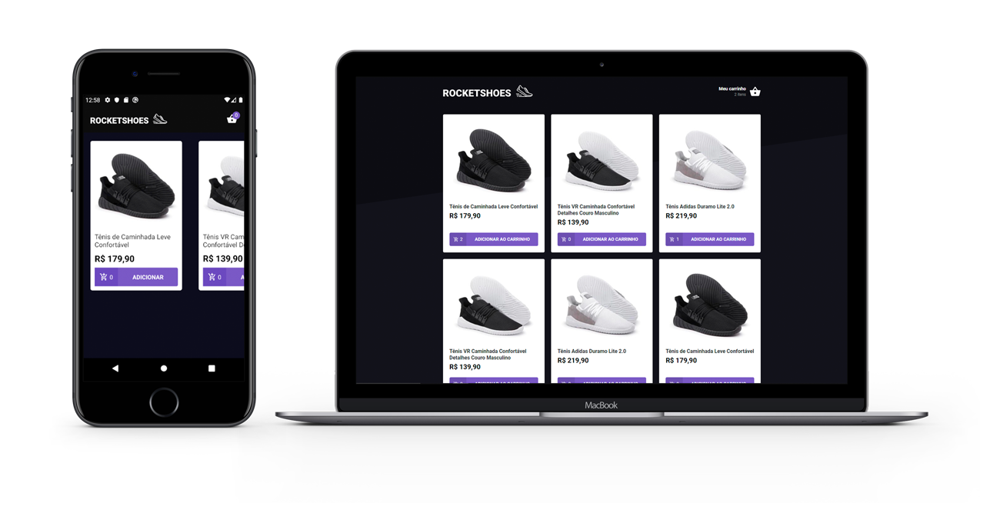

<h1 align="center">
    
</h1>

<h4 align="center">
  Rocketshoes
</h4>

  <a href="#rocket-tecnologias">Tecnologias</a>&nbsp;&nbsp;&nbsp;|&nbsp;&nbsp;&nbsp;
  <a href="#-projeto">Projeto</a>&nbsp;&nbsp;&nbsp;|&nbsp;&nbsp;&nbsp;
  <a href="#-layout">Layout</a>&nbsp;&nbsp;&nbsp;|&nbsp;&nbsp;&nbsp;
  <a href="#memo-licença">Licença</a>

 

  

## :rocket: Tecnologias

Esse projeto foi desenvolvido com as seguintes tecnologias:

- [React](https://reactjs.org)
- [React Native](https://facebook.github.io/react-native/)
- [Redux](https://redux.js.org/)
- [Redux-Saga](https://github.com/redux-saga/redux-saga)

## 💻 Projeto

O Rocketshoes é um projeto criado no módulo 7 do GoStack com o foco em aprender a arquitetura Flux.

## 🔖 Layout

Você pode baixar o layout do projeto no formato `.sketch` através [desse link](.github/layout.sketch).

Para abrir o arquivo no formato `.sketch` em qualquer sistema operacional utilize a ferramenta [Zeplin](https://zeplin.io).

## :memo: Licença

Esse projeto está sob a licença MIT. Veja o arquivo [LICENSE](LICENSE.md) para mais detalhes.

---

Feito com ♥ by Rocketseat :wave: [Entre na nossa comunidade!](https://discordapp.com/invite/gCRAFhc)
